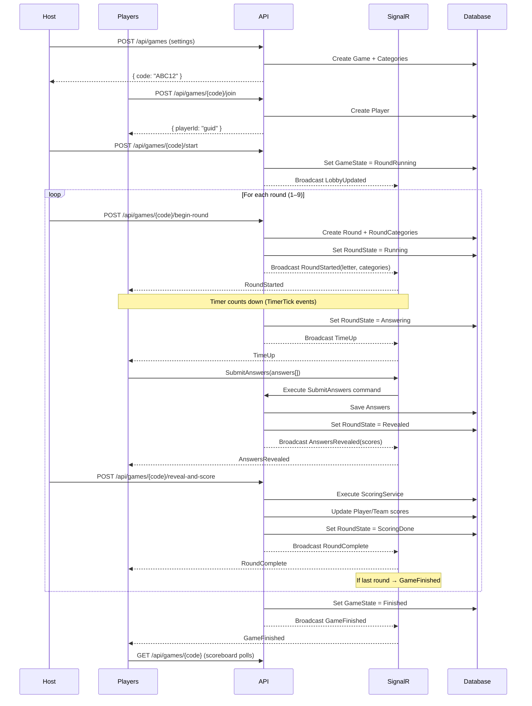
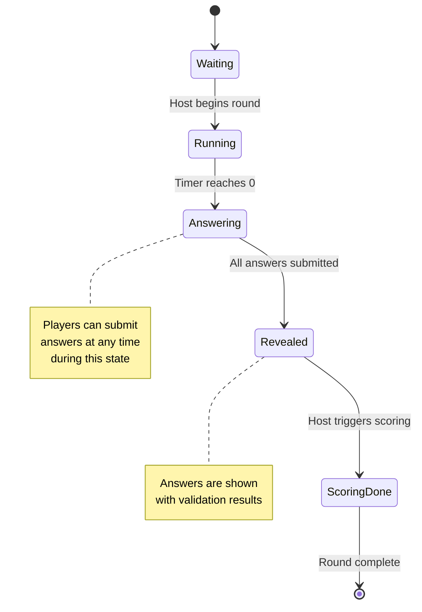

# Scattergories — Design Document

> Technical design for the Scattergories real-time multiplayer word game.

---

## Table of Contents

- [1. System Overview](#1-system-overview)
- [2. Architecture](#2-architecture)
- [3. Data Models](#3-data-models)
- [4. API Design](#4-api-design)
- [5. Real-Time Communication](#5-real-time-communication)
- [6. Authentication & Authorization](#6-authentication--authorization)
- [7. Frontend Architecture](#7-frontend-architecture)
- [8. State Management](#8-state-management)
- [9. Game Flow](#9-game-flow)
- [10. Scoring Engine](#10-scoring-engine)
- [11. Word Filtering](#11-word-filtering)
- [12. Error Handling](#12-error-handling)
- [13. Security Considerations](#13-security-considerations)
- [14. Performance Considerations](#14-performance-considerations)
- [15. Extensibility Points](#15-extensibility-points)
- [16. Design Decisions](#16-design-decisions)

---

## 1. System Overview

### 1.1 Problem Statement

Scattergories is a classic word game where players race to fill categories with words starting with a given letter. The digital version needs to support real-time multiplayer gameplay with fair scoring, answer validation, and a polished user experience.

### 1.2 Solution

A full-stack web application with:
- **Backend**: .NET 10 Web API with SignalR for real-time communication, EF Core for persistence
- **Frontend**: React 19 + TypeScript + Vite + TailwindCSS with Zustand state management
- **Database**: SQLite (development) with support for production databases

### 1.3 Non-Goals

- Mobile native apps (responsive web only)
- Voice/chat communication
- AI-assisted answer validation
- Tournament/league systems
- Social features beyond gameplay

---

## 2. Architecture

### 2.1 Backend — Clean Architecture

```
┌─────────────────────────────────────────────────────────────┐
│                        API Layer                             │
│  ┌──────────────┐  ┌──────────────┐  ┌──────────────────┐  │
│  │  Controllers │  │  Middleware  │  │  Program.cs      │  │
│  │  (REST)      │  │  (CORS, JWT, │  │  (DI, Pipeline)  │  │
│  │              │  │   Swagger)   │  │                  │  │
│  └──────┬───────┘  └──────────────┘  └──────────────────┘  │
│         │                                                    │
├─────────┼────────────────────────────────────────────────────┤
│         ▼                                                    │
│                    Application Layer                         │
│  ┌──────────────────────────────────────────────────────┐   │
│  │  MediatR Pipeline                                     │   │
│  │  ┌─────────────┐  ┌─────────────┐  ┌─────────────┐  │   │
│  │  │  Commands   │  │   Queries   │  │ Validators  │  │   │
│  │  │  (mutate)   │  │  (read)     │  │ (FluentVal) │  │   │
│  │  └──────┬──────┘  └──────┬──────┘  └─────────────┘  │   │
│  └─────────┼────────────────┼──────────────────────────┘   │
│            │                │                               │
├────────────┼────────────────┼───────────────────────────────┤
│            ▼                ▼                               │
│                    Domain Layer                              │
│  ┌──────────────┐  ┌──────────────┐  ┌──────────────────┐  │
│  │   Entities   │  │    Enums     │  │   Services       │  │
│  │  (AGGREGATES)│  │  (State)     │  │  (Interfaces)    │  │
│  └──────────────┘  └──────────────┘  └──────────────────┘  │
│  ┌──────────────┐  ┌──────────────┐                        │
│  │  Exceptions  │  │ ValueObjects │                        │
│  └──────────────┘  └──────────────┘                        │
├─────────────────────────────────────────────────────────────┤
│                    Infrastructure Layer                      │
│  ┌──────────────┐  ┌──────────────┐  ┌──────────────────┐  │
│  │   DbContext  │  │  Services    │  │    SignalR Hub   │  │
│  │  (SQLite)    │  │  (Impl)      │  │   (GameHub)      │  │
│  └──────────────┘  └──────────────┘  └──────────────────┘  │
│  ┌──────────────┐  ┌──────────────┐  ┌──────────────────┐  │
│  │  Authorization│  │   SeedData   │  │  Google Auth     │  │
│  └──────────────┘  └──────────────┘  └──────────────────┘  │
└─────────────────────────────────────────────────────────────┘
```

**Dependency Direction:**

```
API ──→ Application ──→ Domain ←── Infrastructure
```

The Domain layer has **zero dependencies** on other layers. Infrastructure implements interfaces defined in Application/Domain.

### 2.2 Frontend — Component Architecture

```
App (Router)
├── AuthProvider (Context)
│   ├── HashRouter
│   │   ├── Login (Route Guard)
│   │   └── AuthGuard (Protected Routes)
│   │       ├── AuthLayout
│   │       │   ├── Header
│   │       │   └── Routes
│   │       │       ├── Home (Create/Join)
│   │       │       ├── Lobby (Players/Settings)
│   │       │       ├── GamePage (State-Driven)
│   │       │       │   ├── TimerView
│   │       │       │   ├── AnsweringView
│   │       │       │   │   └── CategoryInput (×N)
│   │       │       │   ├── RevealingView
│   │       │       │   └── ScoredView
│   │       │       └── Scoreboard (Final Standings)
│   │       └── Fallback → Login
```

---

## 3. Data Models

### 3.1 Entity Relationship Diagram

```mermaid
erDiagram
    Game ||--o{ Round : "has"
    Game ||--o{ Player : "has"
    Game ||--o{ Team : "has"
    Game ||--o{ Category : "has"
    Game ||--o{ RoundCategory : "has"

    Round ||--o{ RoundCategory : "has"
    Round ||--o{ Answer : "has"

    Player ||--o{ Answer : "submits"
    Player }o--o| Team : "belongs to"
    Player }o--o| UserAccount : "linked to"

    Category ||--o{ RoundCategory : "used in"

    Game {
        Guid Id PK
        string Code UK
        int RoundCount
        int TimerSeconds
        int PointsPerAnswer
        bool AllowPlurals
        bool AllowProperNouns
        bool AllowOffensiveWords
        GameState GameState
        int CurrentRoundNumber
        DateTime CreatedAt
        DateTime StartedAt
        DateTime FinishedAt
    }

    Round {
        Guid Id PK
        Guid GameId FK
        int RoundNumber
        string Letter
        RoundState State
        DateTime StartedAt
        DateTime FinishedAt
    }

    Player {
        Guid Id PK
        Guid GameId FK
        string Name
        Guid? TeamId FK
        bool IsHost
        int TotalScore
        Guid? UserId FK
    }

    Team {
        Guid Id PK
        Guid GameId FK
        string Name
        int TeamScore
    }

    Category {
        Guid Id PK
        string Name UK
        int DisplayOrder
    }

    Answer {
        Guid Id PK
        Guid PlayerId FK
        Guid RoundId FK
        Guid CategoryId FK
        string Text
        bool IsValid
        bool? IsUnique
        int? Points
        DateTime SubmittedAt
    }

    RoundCategory {
        Guid RoundId PK FK
        Guid CategoryId PK FK
    }

    UserAccount {
        Guid Id PK
        string GoogleId UK
        string Email UK
        string DisplayName
        string? ProfileImageUrl
        DateTime LastLoginAt
    }
```

### 3.2 Entity Descriptions

#### Game (Aggregate Root)

The central entity that owns all Rounds, Players, Teams, and Categories for a single game session.

| Property | Type | Description |
|----------|------|-------------|
| `Id` | Guid | Primary key |
| `Code` | string | Unique 5-character code (indexed, unique) |
| `RoundCount` | int | Number of rounds (default: 9) |
| `TimerSeconds` | int | Seconds per round (default: 180) |
| `PointsPerAnswer` | int | Points for a unique answer (default: 10) |
| `AllowPlurals` | bool | Whether plurals are allowed |
| `AllowProperNouns` | bool | Whether proper nouns are allowed |
| `AllowOffensiveWords` | bool | Whether offensive words are allowed |
| `GameState` | enum | Current game state (Lobby → Finished) |
| `CurrentRoundNumber` | int | 0-based index of current round |
| `CreatedAt` | DateTime | UTC creation timestamp |
| `StartedAt` | DateTime? | When the game started |
| `FinishedAt` | DateTime? | When the game finished |

#### Round

Represents a single round identified by a letter (A-Z).

| Property | Type | Description |
|----------|------|-------------|
| `Id` | Guid | Primary key |
| `GameId` | Guid | Foreign key to Game |
| `RoundNumber` | int | 1-based round number |
| `Letter` | string | Single uppercase letter (A-Z) |
| `State` | enum | Round state machine |
| `StartedAt` | DateTime? | When the round timer started |
| `FinishedAt` | DateTime? | When scoring completed |

#### Player

A participant in a game.

| Property | Type | Description |
|----------|------|-------------|
| `Id` | Guid | Primary key |
| `GameId` | Guid | Foreign key to Game |
| `Name` | string | Player display name (max 50 chars) |
| `TeamId` | Guid? | Foreign key to Team (nullable for solo) |
| `IsHost` | bool | Whether this player is the host |
| `TotalScore` | int | Cumulative score across all rounds |
| `UserId` | Guid? | Foreign key to UserAccount (nullable for guests) |

#### Answer

A player's submitted answer for a single category in a single round.

| Property | Type | Description |
|----------|------|-------------|
| `Id` | Guid | Primary key |
| `PlayerId` | Guid | Foreign key to Player |
| `RoundId` | Guid | Foreign key to Round |
| `CategoryId` | Guid | Foreign key to Category |
| `Text` | string | The submitted answer text (max 500 chars) |
| `IsValid` | bool | Passed validation checks |
| `IsUnique` | bool? | Unique across all players (null before scoring) |
| `Points` | int? | Points awarded (null before scoring) |
| `SubmittedAt` | DateTime | When the answer was submitted |

### 3.3 Enumerations

#### GameState

```
Lobby ──→ RoundRunning ──→ Answering ──→ Revealing ──→ Finished
  ↑            │              │
  └────────────┴──────────────┘
```

| State | Description |
|-------|-------------|
| `Lobby` | Game created, players joining |
| `RoundRunning` | Timer counting down, players filling answers |
| `Answering` | Time's up, players can submit answers |
| `Revealing` | Answers revealed with scoring |
| `Finished` | All rounds complete |

#### RoundState

```
Waiting ──→ Running ──→ Answering ──→ Revealed ──→ ScoringDone
```

| State | Description |
|-------|-------------|
| `Waiting` | Round not yet started |
| `Running` | Timer active, players filling answers |
| `Answering` | Time's up, awaiting submissions |
| `Revealed` | Answers shown with validation results |
| `ScoringDone` | Points calculated, scores updated |

---

## 4. API Design

### 4.1 REST Endpoints

#### Authentication

```
POST /api/auth/google          → AuthTokenResponse    (public)
GET  /api/auth/me              → UserDto              (JWT required)
```

#### Games

```
POST   /api/games                          → { code: string }        (public)
POST   /api/games/{code}/join              → { playerId: Guid }      (public)
GET    /api/games/{code}                   → GetGameDto              (public)
PUT    /api/games/{code}/config            → IActionResult           (JWT required)
POST   /api/games/{code}/start             → IActionResult           (JWT required)
POST   /api/games/{code}/begin-round       → BeginRoundResult        (JWT required)
POST   /api/games/{code}/reveal-and-score  → RevealAndScoreResult    (JWT required)
POST   /api/games/{code}/end-game          → EndGameResult           (JWT required)
```

### 4.2 Request/Response DTOs

#### CreateGameRequest

```typescript
interface CreateGameRequest {
  roundCount?: number;           // default: 9
  timerSeconds?: number;         // default: 180
  pointsPerAnswer?: number;      // default: 10
  allowPlurals?: boolean;        // default: false
  allowProperNouns?: boolean;    // default: false
  allowOffensiveWords?: boolean; // default: false
}
```

#### GetGameDto

```typescript
interface GetGameDto {
  id: string;
  code: string;
  gameState: GameStateValue;
  currentRound: RoundDto | null;
  players: PlayerDto[];
  teams: TeamDto[];
  settings: GameSettingsDto;
  rounds: RoundDto[];
}
```

#### BeginRoundResult

```typescript
interface BeginRoundResult {
  roundNumber: number;
  letter: string;
  timerSeconds: number;
  categories: CategoryDto[];
}
```

#### RevealAndScoreResult

```typescript
interface RevealAndScoreResult {
  roundId: string;
  roundNumber: number;
  letter: string;
  scores: ScoredAnswerDto[];
}
```

#### EndGameResult

```typescript
interface EndGameResult {
  standings: FinalScoreDto[];
  winnerName: string;
}
```

### 4.3 Validation Rules

| Field | Rule | Error |
|-------|------|-------|
| `playerName` | 1–50 characters, non-empty | "Player name is required" |
| `gameCode` | 1–10 characters, alphanumeric | "Invalid game code" |
| `answer.text` | 1–500 characters, starts with round letter | "Answer validation failed" |
| `answer.text` | No profanity (if disabled) | "Answer contains offensive language" |
| `answer.text` | No plurals (if disabled) | "Plurals are not allowed" |
| `answer.text` | No proper nouns (if disabled) | "Proper nouns are not allowed" |

---

## 5. Real-Time Communication

### 5.1 SignalR Hub Architecture

```
                    ┌─────────────────────┐
                    │     GameHub         │
                    │  (Authorize)        │
                    └─────────┬───────────┘
                              │
              ┌───────────────┼───────────────┐
              │               │               │
              ▼               ▼               ▼
    ┌────────────────┐ ┌──────────────┐ ┌──────────────┐
    │ JoinGameRoom   │ │ SubmitAnswers│ │ (Internal)   │
    │                │ │              │ │ MediatR      │
    │ - Validate     │ │ - Validate   │ │ Commands     │
    │   game code    │ │   answers    │ │              │
    │ - Validate     │ │ - Execute    │ │ BeginRound   │
    │   player       │ │   command    │ │ RevealAnd    │
    │ - Join group   │ │ - Broadcast  │ │ Score        │
    │ - Broadcast    │ │   result     │ │ EndGame      │
    └────────────────┘ └──────────────┘ └──────────────┘
```

### 5.2 Connection Lifecycle

```
Client                          GameHub
  │                               │
  │── HubConnection.start() ──────▶│   (JWT via accessTokenFactory)
  │                               │
  │── JoinGameRoom(code, id) ─────▶│   Validate game, validate player
  │                               │   Add to SignalR group
  │                               │
  │◀── LobbyUpdated(state) ────────│   Broadcast to group
  │                               │
  │── (timer countdown) ──────────│   (Server sends TimerTick)
  │                               │
  │── SubmitAnswers(code, []) ────▶│   Execute command, broadcast result
  │                               │
  │◀── AnswersRevealed(data) ──────│   Broadcast to group
  │                               │
  │◀── RoundComplete ──────────────│   Next round or finish
  │                               │
  │◀── GameFinished ───────────────│   All rounds done
  │                               │
```

### 5.3 Connection Tracking

Two `ConcurrentDictionary` instances track connections for disconnect detection:

```csharp
// ConnectionId → GameCode mapping
static readonly ConcurrentDictionary<string, string> _connectionToGame;

// GameCode → Set of ConnectionIds
static readonly ConcurrentDictionary<string, HashSet<string>> _gameConnections;
```

On disconnect, the hub iterates `_connectionToGame` to find players who left without leaving gracefully.

### 5.4 Auto-Reconnect

```typescript
// Client-side
conn.onreconnecting(() => {
  console.warn('SignalR reconnecting...');
});

conn.onreconnected(() => {
  // Re-join the game group after reconnect
  connection.invoke('JoinGameRoom', gameCode, playerName, playerId);
});
```

---

## 6. Authentication & Authorization

### 6.1 Authentication Flow

```
┌─────────┐     ┌──────────┐     ┌──────────┐     ┌──────────┐     ┌──────────┐
│ Browser │     │  React   │     │  Google  │     │  Backend │     │  SQLite  │
│ (User)  │     │  Frontend│     │  OAuth   │     │  API     │     │  DB      │
└────┬────┘     └────┬─────┘     └────┬─────┘     └────┬─────┘     └────┬─────┘
     │               │                │                │                │
     │  Click "Sign  │                │                │                │
     │   in with     │                │                │                │
     │   Google"     │                │                │                │
     │──────────────▶│                │                │                │
     │               │                │                │                │
     │               │  OAuth flow    │                │                │
     │               │────────────────▶│                │                │
     │               │                │                │                │
     │               │  ← Google ID   │                │                │
     │               │     Token      │                │                │
     │               │◀───────────────│                │                │
     │               │                │                │                │
     │               │ POST /api/auth/google            │                │
     │               │ { idToken }  ───────────────────▶│                │
     │               │                │  Verify token    │                │
     │               │                │  with Google     │                │
     │               │                │  APIs.Auth       │                │
     │               │                │                │  Lookup/Create   │
     │               │                │                │  UserAccount     │
     │               │                │                │─────────────────▶│
     │               │                │                │◀─────────────────│
     │               │                │                │                │
     │               │                │                │ Generate JWT     │
     │               │                │                │                │
     │               │◀── AuthTokenResponse ────────────│                │
     │               │  { accessToken, user } ◀─────────│                │
     │               │                │                │                │
     │               │ Store token in │                │                │
     │               │ localStorage   │                │                │
     │               │                │                │                │
```

### 6.2 JWT Token Structure

```json
{
  "iss": "Scattergories",
  "aud": "scattergories-client",
  "nameid": "<user-guid>",
  "email": "player@example.com",
  "name": "Player Name",
  "exp": <unix-timestamp>,
  "iat": <unix-timestamp>
}
```

### 6.3 Authorization

| Endpoint | Auth Method |
|----------|-------------|
| `/api/auth/google` | None (public) |
| `/api/auth/me` | JWT Bearer |
| `/api/games` (POST) | None (public) |
| `/api/games/{code}/join` | None (public) |
| `/api/games/{code}` (GET) | None (public) |
| `/api/games/{code}/config` (PUT) | JWT Bearer (host only) |
| `/api/games/{code}/start` | JWT Bearer (host only) |
| `/api/games/{code}/begin-round` | JWT Bearer (host only) |
| `/api/games/{code}/reveal-and-score` | JWT Bearer (host only) |
| `/api/games/{code}/end-game` | JWT Bearer (host only) |
| SignalR Hub | JWT Bearer (query string or header) |

### 6.4 SignalR JWT Passing

```typescript
// Via accessTokenFactory
new HubConnectionBuilder()
  .withUrl('/hubs/game', {
    accessTokenFactory: () => localStorage.getItem('authToken'),
  })

// Via query string (configured in JwtBearerEvents.OnMessageReceived)
options.Events = {
  OnMessageReceived: context => {
    const accessToken = context.Request.Query['authToken'];
    if (!string.IsNullOrEmpty(accessToken))
      context.Token = accessToken;
    return Task.CompletedTask;
  }
};
```

---

## 7. Frontend Architecture

### 7.1 Routing

```
HashRouter (client-side routing)
├── /login          → Login page (redirect to / if authenticated)
├── /               → Home page (create/join game)
├── /lobby/:code    → Lobby (players, settings, start game)
├── /game/:code     → Game page (state-driven views)
└── /scoreboard/:code → Scoreboard (final standings)
```

### 7.2 Route Guards

```typescript
function AuthGuard() {
  const isAuthenticated = useIsAuthenticated();
  if (!isAuthenticated) return <Login />;
  return <AuthLayout />;
}
```

### 7.3 Component Hierarchy

#### GamePage State-Driven Rendering

```
GamePage
  │
  └─ switch (game.gameState)
       │
       ├─ 'RoundRunning'  → TimerView
       │                     (countdown, letter, categories)
       │
       ├─ 'Answering'     → AnsweringView
       │                     (category input fields)
       │                     └─ CategoryInput (×N)
       │
       ├─ 'Revealing'     → RevealingView
       │                     (answers with validation badges)
       │
       └─ 'Finished'      → navigate('/scoreboard/:code')
```

### 7.4 UI Component Library

| Component | Purpose | Location |
|-----------|---------|----------|
| `GlassButton` | Glassmorphism button | `components/common/` |
| `GlassCard` | Glassmorphism card | `components/common/` |
| `GlassInput` | Glassmorphism input | `components/common/` |
| `GlassAvatar` | Player avatar | `components/common/` |
| `GlassBadge` | Status badge | `components/common/` |
| `LoadingSpinner` | Loading indicator | `components/common/` |
| `ErrorState` | Error display | `components/common/` |
| `TimerView` | Round timer display | `components/game/` |
| `AnsweringView` | Answer input form | `components/game/` |
| `RevealingView` | Answer reveal | `components/game/` |
| `ScoredView` | Scored answers | `components/game/` |
| `PlayerList` | Player roster | `components/lobby/` |
| `TeamCard` | Team info | `components/lobby/` |
| `SettingsGrid` | Game settings | `components/lobby/` |
| `GameCodeBanner` | Game code display | `components/lobby/` |

---

## 8. State Management

### 8.1 Zustand Stores

#### Game Store (`gameStore.ts`)

```typescript
interface GameStore extends PlayerState {
  // State
  playerName: string;
  playerId: string | null;
  gameCode: string | null;
  game: GameDto | null;
  hubConnected: boolean;
  roundTimer: number;
  roundTimerTotal: number;
  isTimerActive: boolean;

  // Actions
  setPlayerName: (name: string) => void;
  joinGame: (code: string, playerName: string) => void;
  setGame: (game: GameDto) => void;
  setHubConnected: (connected: boolean) => void;
  setRoundTimer: (seconds: number, total: number, active: boolean) => void;
  reset: () => void;
}
```

**Design Rationale:** Single store instead of multiple stores to avoid synchronization issues. The store mirrors the backend `GetGameDto` structure.

#### Auth Store (`authStore.ts`)

```typescript
interface AuthState {
  isAuthenticated: boolean;
  user: UserAccount | null;
  setAuth: (token: string, user: UserAccount) => void;
  logout: () => void;
}
```

### 8.2 React Context

#### AuthContext

Provides authentication state and login methods to the component tree:

```typescript
interface AuthContextValue {
  isAuthenticated: boolean;
  user: UserAccount | null;
  isLoading: boolean;
  login: (playerName: string) => Promise<void>;
  handleGoogleLogin: () => void;
  logout: () => void;
}
```

### 8.3 State Flow

```
User Action
    │
    ▼
React Component
    │
    ├─→ apiClient.ts ──→ REST API ──→ Backend (MediatR Command)
    │
    └─→ hubConnection.ts ──→ SignalR ──→ GameHub ──→ Broadcast
    │                                              │
    │◀──────────── LobbyUpdated / RoundStarted ────┘
    │
    ▼
Zustand Store Update
    │
    ▼
Component Re-render
```

---

## 9. Game Flow

### 9.1 Complete Game Lifecycle



### 9.2 Round State Transitions



---

## 10. Scoring Engine

### 10.1 Three-Phase Scoring

```
Phase 1: Validate                    Phase 2: Uniqueness              Phase 3: Points
────────────                          ────────────                     ─────────
For each answer:                      For each valid answer:         For each answer:
  ├─ Starts with round letter?         ├─ Collect all valid answers   ├─ If valid AND unique:
  ├─ Not empty?                          for this category              points = game.PointsPerAnswer
  ├─ No profanity? (if disabled)       ├─ Group by text (case-fold)   └─ Else:
  ├─ No plurals? (if disabled)          ├─ Mark unique if count == 1    points = 0
  └─ No proper nouns? (if disabled)
```

### 10.2 ScoringService Implementation

```csharp
public async Task<ScoringResult> ScoreRound(Game game, Round round)
{
    var answers = round.Answers.ToList();

    // Phase 1: Validate
    ValidateAnswers(answers, round);

    // Phase 2: Uniqueness
    DetermineUniqueness(answers, game);

    // Phase 3: Calculate points
    foreach (var answer in answers)
    {
        int points = (answer.IsValid && answer.IsUnique == true)
            ? game.PointsPerAnswer
            : 0;
        answer.Points = points;
    }

    // Update player and team totals
    UpdatePlayerScores(answers, game);
    UpdateTeamScores(answers, game);

    // Update round state
    round.State = RoundState.ScoringDone;

    // Check if game is finished
    if (game.CurrentRoundNumber >= game.RoundCount)
        game.GameState = GameState.Finished;
    else
        game.CurrentRoundNumber++;

    return new ScoringResult(scoredAnswers, playerScores, teamScores);
}
```

### 10.3 Scoring Rules Summary

| Scenario | Valid | Unique | Points |
|----------|-------|--------|--------|
| "Alligator" (A, Animal) | ✅ | ✅ (only player) | 10 |
| "Alligator" (A, Animal) | ✅ | ❌ (another player has it) | 0 |
| "alligator" (A, Animal) | ✅ | ✅ | 10 |
| "apples" (A, Food) | ❌ (plural) | — | 0 |
| "Apple" (A, Thing) | ❌ (proper noun) | — | 0 |
| "" (empty) | ❌ | — | 0 |

---

## 11. Word Filtering

### 11.1 WordFilterService

```csharp
public interface IWordFilterService
{
    bool ContainsProfanity(string text);
    bool IsPlural(string text);
    bool IsProperNoun(string text);
}
```

### 11.2 Plural Detection

Uses suffix matching (longest-first to avoid false positives):

| Suffix | Example | Notes |
|--------|---------|-------|
| `-ies` | "Apples" → "Apple" | Common |
| `-ses` | "Boxes" → "Box" | -x/-s endings |
| `-xes` | "Watches" → "Watch" | -ch/-sh endings |
| `-ches` | "Dishes" → "Dish" | |
| `-shes` | "Shoes" → "Shoe" | |
| `-es` | "Buses" → "Bus" | |
| `-s` | "Cats" → "Cat" | Only if stem ≥ 3 chars (reduces noise) |

### 11.3 Proper Noun Detection

Checks for uppercase letters after the first character:

```csharp
for (var i = 1; i < text.Length; i++)
{
    if (char.IsUpper(text[i]))
        return true;  // e.g., "Apple", "McDonald"
}
```

### 11.4 Profanity Filter

Built-in banned words list (case-insensitive substring match):

```csharp
private static readonly string[] _profanityList =
{
    "fuck", "shit", "damn", "bitch", "bastard", "crap", "piss", "ass",
    "dick", "cock", "pussy", "whore", "slut", "nigger", "nigga",
    "faggot", "fag", "retard", "retarded", "cunt", "boob", "tits",
    "penis", "vagina", "anus", "rape", "rapist", "murder", "kill",
    "die", "dead"
};
```

**Extensibility:** The list can be externalized to configuration or a database table for customization.

---

## 12. Error Handling

### 12.1 Backend Error Strategy

| Exception Type | HTTP Status | Usage |
|----------------|-------------|-------|
| `ScattergoriesException` | 400 Bad Request | Game logic errors (invalid state transition, game full) |
| `SecurityException` | 401 Unauthorized | Token validation failures |
| `HubException` | 400 Bad Request | SignalR-specific errors |
| Unhandled Exception | 500 Internal Server Error | Unexpected errors |

### 12.2 Frontend Error Handling

```typescript
// API errors
try {
  const code = await apiClient.createGame(settings);
  navigate(`/lobby/${code}`);
} catch (e) {
  setError(e instanceof Error ? e.message : 'Failed to create game');
}

// SignalR errors
hubConnection.on('PlayerError', (error: string) => {
  toast.error(error);
});
```

### 12.3 Error States

```
┌─────────────────────────────────┐
│         ErrorState              │
│                                 │
│   ⚠️  [Error Icon]              │
│   [Error Message]               │
│                                 │
│   [Action Button]               │
│                                 │
└─────────────────────────────────┘
```

---

## 13. Security Considerations

### 13.1 Authentication Security

| Concern | Mitigation |
|---------|------------|
| Token theft | JWT stored in `localStorage` (trade-off for simplicity) |
| SignalR auth | JWT passed via `accessTokenFactory` or query string |
| Token replay | Short-lived tokens (1 hour) with `ValidateLifetime` |
| CORS | Configured to allow only trusted origins |
| Input validation | FluentValidation on all endpoints |

### 13.2 Input Validation

```csharp
// Game code length
if (gameCode.Length > 10)
    throw new HubException("Game code is too long.");

// Answer text length
if (answer.Text.Length > 500)
    throw new HubException("Answer text is too long.");

// Player name length
if (name.Length > 50)
    name = name[..50];
```

### 13.3 Data Protection

| Concern | Mitigation |
|---------|------------|
| SQL injection | EF Core parameterized queries |
| XSS | React automatic escaping |
| CSRF | JWT-based auth (no cookies) |
| Rate limiting | Not implemented (consider for production) |

---

## 14. Performance Considerations

### 14.1 Database

| Concern | Strategy |
|---------|----------|
| N+1 queries | `.Include()` and `.ThenInclude()` in queries |
| Connection pooling | SQLite handles this internally |
| Transaction safety | `SaveChangesAsync` wrapped in transactions for commands |

### 14.2 SignalR

| Concern | Strategy |
|---------|----------|
| Bandwidth | Only broadcast state changes, not full polling |
| Reconnection | Automatic with group re-joining |
| Disconnect detection | `ConcurrentDictionary` tracking |
| Scalability | Single-server (consider Redis backplane for multi-instance) |

### 14.3 Frontend

| Concern | Strategy |
|---------|----------|
| Re-renders | Zustand selectors for fine-grained updates |
| Bundle size | Vite code splitting, lazy loading |
| Memory | Cleanup SignalR connections on unmount |

---

## 15. Extensibility Points

### 15.1 Adding New Categories

Categories are seeded data. Add to the seed:

```csharp
// Infrastructure/SeedData/CategorySeeder.cs
new Category("Country", 10),
new Category("Sport", 11),
new Category("Movie", 12),
```

### 15.2 Adding New Game Modes

Extend `Game` entity and `GameState` enum:

```csharp
public enum GameState
{
    Lobby,
    RoundRunning,
    Answering,
    Revealing,
    Finished,
    // New:
    TeamBattle,
    SpeedRound
}
```

### 15.3 Adding New Validation Rules

Extend `IWordFilterService`:

```csharp
public interface IWordFilterService
{
    bool ContainsProfanity(string text);
    bool IsPlural(string text);
    bool IsProperNoun(string text);
    // New:
    bool IsTooShort(string text, int minLength);
    bool ContainsNumbers(string text);
}
```

### 15.4 Adding New API Endpoints

1. Define Command/Query in `Application/Features/Games/`
2. Create handler implementing `IRequestHandler<TCommand, TResponse>`
3. Add endpoint to `GamesController`
4. Add TypeScript interface in `Client/src/api/types.ts`
5. Add API client method in `Client/src/api/apiClient.ts`

### 15.5 Switching Database

Change the DbContext registration in `Program.cs`:

```csharp
// SQLite (current)
options.UseSqlite(connectionString);

// SQL Server
options.UseSqlServer(connectionString);

// PostgreSQL
options.UseNpgsql(connectionString);
```

---

## 16. Design Decisions

### 16.1 Why Clean Architecture?

| Factor | Decision | Rationale |
|--------|----------|-----------|
| Layering | Clean Architecture | Separates concerns, enables testing, supports future changes |
| CQRS | MediatR | Clear separation of read/write operations, easy to add validators |
| State Machine | Enum-based | Simple, explicit, easy to debug and test |

### 16.2 Why SignalR over WebSockets?

| Factor | Decision | Rationale |
|--------|----------|-----------|
| Real-time | SignalR | Built-in fallbacks (WebSockets → Server-Sent Events → Long Polling) |
| Grouping | SignalR Groups | Native support for game-room isolation |
| Auth | JWT Bearer | Standard, works with existing auth pipeline |

### 16.3 Why Zustand over Redux?

| Factor | Decision | Rationale |
|--------|----------|-----------|
| State | Zustand | Minimal boilerplate, no providers needed, TypeScript-friendly |
| Complexity | Single store | Game state is not complex enough to warrant Redux |

### 16.4 Why SQLite?

| Factor | Decision | Rationale |
|--------|----------|-----------|
| Development | SQLite | Zero configuration, embedded, file-based |
| Production | Swappable | `IApplicationDbContext` interface allows easy switch |
| Scale | Adequate | Single-player games don't need distributed DB |

### 16.5 Why HashRouter?

| Factor | Decision | Rationale |
|--------|----------|-----------|
| Routing | HashRouter | No server configuration needed, works with static hosting |
| Alternative | BrowserRouter | Would require server-side rewrite rules |

### 16.6 Why Guest Mode?

| Factor | Decision | Rationale |
|--------|----------|-----------|
| Auth | Google + Guest | Lower barrier to entry, users can play immediately |
| Identity | `StubCurrentPlayer` | Development-friendly, production uses JWT claims |

### 16.7 Cross-Team Uniqueness

**Design Decision:** An answer that is unique within a player's team but duplicated by another team still scores 10 points to both teams.

**Rationale:** This encourages creativity without punishing players for accidentally using the same common answer. The competitive element is between teams, not individuals.

---

## Appendix A: Glossary

| Term | Definition |
|------|------------|
| **Game** | A complete session of Scattergories with 9 rounds |
| **Round** | A single letter-based challenge within a game |
| **Category** | A word prompt (e.g., "Animal", "Place") |
| **Host** | The first player to join a game; controls game flow |
| **Team** | A group of players whose scores are combined |
| **Scoring** | The three-phase process of validating, checking uniqueness, and awarding points |
| **SignalR Group** | A named collection of connections (one per game code) |
| **CQRS** | Command Query Responsibility Segregation — separating read and write operations |
| **Aggregate Root** | The Game entity that controls access to related entities |

## Appendix B: File Index

### Backend

| File | Lines | Purpose |
|------|-------|---------|
| `API/Program.cs` | ~150 | DI, middleware, seeding |
| `API/Controllers/GamesController.cs` | ~200 | REST endpoints |
| `API/Controllers/AuthController.cs` | ~150 | Google auth, JWT |
| `Application/Features/Games/Commands/*.cs` | ~20 each | CQRS commands |
| `Application/Features/Games/Queries/*.cs` | ~15 each | CQRS queries |
| `Domain/Entities/Game.cs` | ~50 | Game entity |
| `Domain/Entities/Player.cs` | ~40 | Player entity |
| `Domain/Entities/Round.cs` | ~40 | Round entity |
| `Domain/Entities/Answer.cs` | ~40 | Answer entity |
| `Domain/Entities/Team.cs` | ~35 | Team entity |
| `Domain/Entities/Category.cs` | ~30 | Category entity |
| `Domain/Enums/GameState.cs` | ~30 | Game state enum |
| `Domain/Enums/RoundState.cs` | ~20 | Round state enum |
| `Infrastructure/Data/ScattergoriesDbContext.cs` | ~100 | EF Core config |
| `Infrastructure/Services/ScoringService.cs` | ~100 | Scoring logic |
| `Infrastructure/Services/LetterService.cs` | ~30 | Letter selection |
| `Infrastructure/Services/WordFilterService.cs` | ~60 | Answer filtering |
| `Infrastructure/SignalR/GameHub.cs` | ~200 | SignalR hub |
| `Infrastructure/Services/GoogleAuthService.cs` | ~60 | Google token verification |

### Frontend

| File | Lines | Purpose |
|------|-------|---------|
| `src/App.tsx` | ~60 | Router, auth guards |
| `src/api/hubConnection.ts` | ~100 | SignalR client |
| `src/api/apiClient.ts` | ~80 | REST client |
| `src/api/types.ts` | ~80 | TypeScript interfaces |
| `src/state/gameStore.ts` | ~60 | Zustand game store |
| `src/state/authStore.ts` | ~40 | Zustand auth store |
| `src/context/AuthContext.tsx` | ~80 | Auth context provider |
| `src/pages/Home.tsx` | ~100 | Landing page |
| `src/pages/Login.tsx` | ~80 | Login page |
| `src/pages/Lobby.tsx` | ~80 | Lobby page |
| `src/pages/GamePage.tsx` | ~120 | Game page |
| `src/pages/Scoreboard.tsx` | ~80 | Scoreboard page |
| `vite.config.ts` | ~25 | Vite + proxy config |
